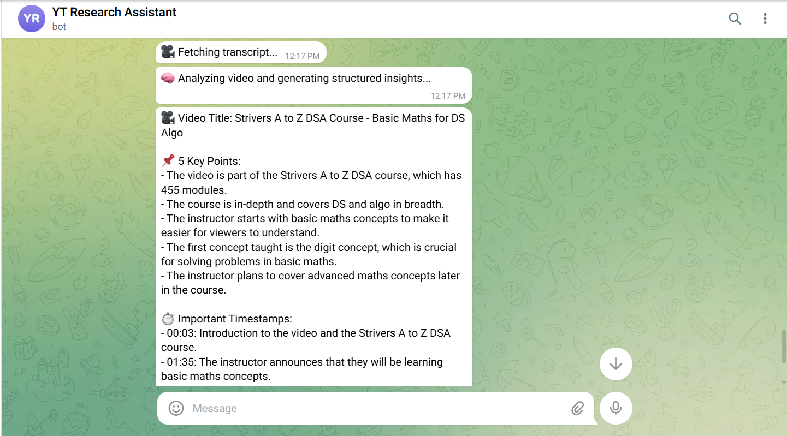

# YT Research Assistant

## Telegram YouTube Summarizer & Q&A Bot

---

## Project Overview

YT Research Assistant is a Telegram bot that helps users quickly understand and interact with long YouTube videos.

The system allows users to:

- Submit a YouTube link
- Receive a structured summary
- Ask contextual follow-up questions
- Extract actionable insights
- Request responses in multiple Indian languages

---

## Core Features

### Structured Summary

When a YouTube link is submitted, the bot returns:

- Video Title
- 5 Key Points
- Important Timestamps
- Core Takeaway

The output is structured and concise rather than an unformatted paragraph.

---

### Contextual Q&A

After a video is processed, users can ask follow-up questions.

The system:
- Splits transcript into chunks
- Ranks relevant chunks using similarity scoring
- Generates answers strictly grounded in transcript context

If the information is not present in the transcript, the bot responds with:

> This topic is not covered in the video.

---

### Action Points Extraction

Users can request:

`action points`

The bot extracts practical insights from the video in a structured format.

---

### Multi-language Support

Supported languages:

- English (default)
- Hindi
- Telugu
- Tamil
- Kannada
- Marathi

Users can request summaries or answers in their preferred language.

---

## Architecture

### System Flow

User (Telegram)
→ Transcript Retrieval
→ Text Chunking
→ Context Ranking
→ LLM Processing
→ Structured Output

---

### Design Decisions

**Transcript Handling**
- Uses youtube-transcript-api
- Handles missing or disabled transcripts
- Truncates long transcripts for efficiency

**Context Management**
- Lightweight chunking strategy
- Simple similarity-based ranking
- In-memory per-user session storage

**LLM Integration**
- Groq API (llama-3.1-8b-instant)
- Low temperature to reduce hallucination
- Strict prompt formatting for structured outputs

**Error Handling**
- Invalid YouTube URLs
- Transcript not available
- Question asked before video submission
- Multi-user session separation

---

## Functional Requirement Coverage

| Requirement | Status |
|-------------|--------|
| Accept YouTube link | Implemented |
| Fetch transcript | Implemented |
| Structured summary | Implemented |
| Contextual Q&A | Implemented |
| Multi-language support | Implemented |
| Error handling | Implemented |
| Multiple user sessions | Implemented |

---

## Setup Instructions

### 1. Clone Repository

git clone https://github.com/pranishareddy21/yt-research-assistant.git  
cd yt-research-assistant  

### 2. Install Dependencies

pip install -r requirements.txt  

### 3. Configure Environment Variables

Create a `.env` file:

BOT_TOKEN=your_telegram_bot_token  
GROQ_API_KEY=your_groq_api_key  

### 4. Run the Bot

python bot.py  

---

## Edge Cases Handled

- Invalid YouTube URL
- Missing transcript
- Long videos
- Follow-up without context
- Multi-user session handling

---

## Future Improvements

- Embedding-based semantic retrieval
- Transcript caching layer
- Persistent session storage
- Cloud deployment

---
## Screenshots

### Summary Output

### Q&A Example

### Multi-language Support

---

## Demo Video

Watch the demo here:  
[Project Demo](https://drive.google.com/file/d/1sP5AEOWzne4bnef1WHF-cGw_2uVvVlom/view?usp=sharing)

